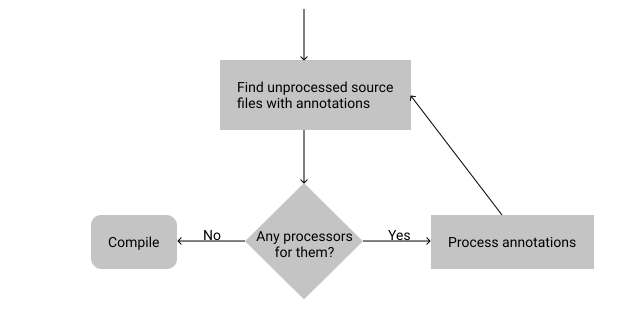

# kotlin-android-project

<!-- START doctoc generated TOC please keep comment here to allow auto update -->
<!-- DON'T EDIT THIS SECTION, INSTEAD RE-RUN doctoc TO UPDATE -->

- [Introduction](#introduction)
- [Annotation processing](#annotation-processing)
- [Project structure](#project-structure)
- [Future work - building an index of annotated classes](#future-work---building-an-index-of-annotated-classes)
- [Converting Groovy scripts to Kotlin DSL](#converting-groovy-scripts-to-kotlin-dsl)
- [Debugging](#debugging)
- [References](#references)

<!-- END doctoc generated TOC please keep comment here to allow auto update -->

# Introduction

This project shows how to create annotation processors using Kotlin and Android. The main example is a RecyclerView
who's adapter is generated via annotations.

Here's what the annotated code looks like for a "data model" class, which is simply a class w/ some properties that need
to be mapped to each row of a RecyclerView (which is declared in `item_person_renderer.xml`). There are only 2
annotations:

1. Class level annotation `@AdapterModel`. This generates a source file w/ the name `Adapter` appended at the end of the
   name of the class annotated w/ this. For the example below, the `PersonAdapter` class is generated.
2. Property level annotation `@ViewHolderBinding`. These can be added to properties of the class that has been annotated
   w/ `@AdapterModel`.

```kotlin
@AdapterModel(R.layout.item_person_renderer)
data class Person(
    @ViewHolderBinding(R.id.name) val name: String,
    @ViewHolderBinding(R.id.address) val address: String
)
```

Here's what the code looks like in the simple Activity that loads a bunch of data, which is then displayed in a
RecyclerView. The magic here is that the `PersonAdapter` is generated by the annotation processor! When the data model
classes change, the adapter is regenerated when you rebuild your project!

```kotlin
class MainActivity : AppCompatActivity() {
  override fun onCreate(savedInstanceState: Bundle?) {
    setTheme(R.style.AppTheme)
    super.onCreate(savedInstanceState)
    setContentView(R.layout.activity_main)
    recyclerView.apply {
      layoutManager = LinearLayoutManager(this@MainActivity)
      adapter = PersonAdapter(listOf(
        Person("John Doe", "123 Street"),
        Person("Jane Doe", "789 Street")
      ))
    }
  }
}
```

# Annotation processing

Here’s a quick breakdown of the core concepts.

- Annotation processing is a tool built into javac for scanning and processing annotations at compile time.
- It can create new source files; however, it can’t modify existing ones.
- It’s done in rounds. The first round starts when the compilation reaches the pre-compile phase. If this round
  generates any new files, another round starts with the generated files as its input. This continues until the
  processor processes all the new files.



# Project structure

This project has 3 modules:

- `app` - contains the Activity and RecyclerView (and uses the annotations defined below). The "data model" class is in
  this module and the annotations are actually used on classes here.
- `annotations` - contains the custom annotations that we've defined. There are two annotations, one at a class level,
  and the other at a property level (of the properties enclosed by the class).
- `processor` - contains the actual processor that generates the source files on compile.
  1. The processor looks for the class level annotation and enclosed property level annotations, and gathers the
     metadata from them in the `metadata.kt` classes.
  2. The metadata is then passed to the `codegen.kt` classes in order to generate the RecyclerView adapter corresponding
     to the data model.
  3. When you build the project, the generated files can be found in the following folder:
     `${buildDir.absolutePath}/generated/source/kotlin`. The actual file that's generated is `PersonAdapter.kt`.

There is a bunch of glue that enables annotation processing in the `build.gradle.kts` files of each of these modules. In
summary:

1. The annotations have to be imported in various modules.
2. The processor has to be run as well by the `app` module.

# Future work - building an index of annotated classes

There are times when it would be useful to find all the classes that are annotated w/ a particular annotation. For a
made up example, in our activity, instead of populating the RecyclerView adapter w/ dummy data, we could have found all
the classes and methods where our annotations appear in the code, and then display that in the list.

Sadly, in Android due to the way in which DEX files work, it's not as easy as it would be in a normal JVM. Libraries
like [classgraph](https://github.com/classgraph/classgraph) fail to work on Android. And there are hacks to scan DEX
files to find annotated classes, but those
[are slow and dangerous to use](https://bravenewgeek.com/implementing-spring-like-classpath-scanning-in-android/).

I was also curious about how ButterKnife works, where you have to set it in motion by calling `bind(this)`. Even when
classes are generated, they won't "activate" until they are referenced from someplace. So at some point, the code using
the generated code has to make a call to load the generated class. In our activity, this happens when `PersonAdapter` is
directly referenced. But this is not optimal. Perhaps a better way would be one by ButterKnife used in this
[nice example here](https://emo-pass.com/2017/11/26/builing-things-with-java-reflection-and-annotation-processing/). It
uses reflection and annotation processing in order to work. Here's the
[code for the `bind()` method](https://github.com/quangctkm9207/prefpin/blob/master/prefpin/src/main/java/prefpin/PrefPin.java#L42).

# Converting Groovy scripts to Kotlin DSL

The Groovy gradle files have been converted to Kotlin DSL. Also, note that there are very few files in `buildSrc` that
contain variables about dependencies and version numbers. These are updated by Android Studio, and putting them in
variables defeats Studio's efforts to automatically upgrade these for you, so it's best to keep it really simple for
simple projects like this one.

You can learn more about how to migrate from Groovy to Kotlin DSL here:

- https://proandroiddev.com/the-new-way-of-writing-build-gradle-with-kotlin-dsl-script-8523710c9670

# Debugging

To learn more about debugging your annotation process, check out this link:

- https://medium.com/@cafonsomota/debug-annotation-processor-in-kotlin-6eb462e965f8

# References

- [Android & Kotlin annotation processing tutorial](https://www.raywenderlich.com/8574679-annotation-processing-supercharge-your-development)
- [Another tutorial like above](https://medium.com/@jintin/annotation-processing-in-java-3621cb05343a)
- [Java annotation processing tutorial](http://hannesdorfmann.com/annotation-processing/annotationprocessing101)
- [Runtime annotations and reflection](https://gist.github.com/championswimmer/d7b9be0c26ac88de2455a80117137ec6)
- [Kotlin in Action book](https://livebook.manning.com/book/kotlin-in-action/chapter-10/55)
